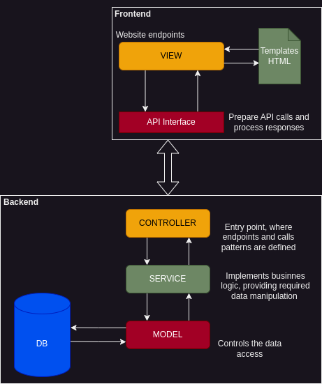

# Rental System


[](https://github.com/mSimon12/rental_system/actions)
[](https://codecov.io/gh/mSimon12/rental_system)

**Rental System** is a simple, multi-service web application designed to help stores manage 
product rentals as they grow. It offers a backend API and a web interface that handle client 
registration, item availability, rental tracking, and administrative stock management.

This application is composed of two services:
- A RESTful **Backend API** built with Flask ([code here](./backend))
- A Flask-based **Frontend** for store operators and clients ([code here](./frontend))

---

## 🚀 Features

- 🔐 JWT-based user authentication
- 🧾 Client registration, login, and session management  
- 📦 Item rental and return workflows  
- 🗃️ Track which client rented which item  
- 🔄 Admin view for inventory and stock management  
- 🌐 Simple Jinja-based web interface  
- 🐳 Fully Dockerized with multi-service support  
- 🧪 Unit testing and basic CI setup  

---

## 🛠️ Tech Stack

<div align="left">
  
  
  
  
  
  
  
  
  
  
  
  
</div>

---

## ⚙️ Getting Started

Follow these steps to set up and run the Rental System application locally or using Docker.

### 🔧 Clone the Repository

```bash
git clone https://github.com/mSimon12/rental_system
cd rental_system
```

### 🔐 Environment Setup

Both backend and frontend services require a .env file for basic API key authentication. For development, you can use default values:
```bash
echo -e 'API_KEY=default-key\nAPI_SECRET=default-secret' > backend/flaskr/.env
echo -e 'API_KEY=default-key\nAPI_SECRET=default-secret' > frontend/flaskr/.env
```
> [!NOTE]  
> Be sure to replace these values with secure credentials in production environments.


## ▶️ Running the Application
You can run the system either directly on your machine or using Docker.

### 🐍 Option 1: Run Without Containers
1. Install the required Python packages ``pip install -r requirements.txt``
2. Open two terminals.
- Terminal 1: Start the backend

```bash
# Starts the application database
flask --app backend/flaskr init-db

# Starts the API application
flask --app backend/flaskr run -p 5001
```

 - Terminal 2: Start the frontend

```bash
# Starts the application Frontend
flask --app frontend/flaskr run -p 5000
```

### 🐳 Option 2: Run with Docker (Recommended)
Start both backend and frontend services using Docker Compose:

```bash
# Starts the complete app 
docker compose -f deploy/compose.yaml up --build
```
Once running, access the services at:
- Frontend: http://localhost:5000
- Backend API: http://localhost:5001


## 🛣️ Roadmap

### 🔧 Backend

- [x] Built a REST API using Flask (based on the [Flask Getting Started tutorial](https://flask.palletsprojects.com/en/3.0.x/tutorial/)).
- [x] Configured SQLite database with models for clients and items.
- [x] Implemented CRUD operations for items and rentals.
- [x] Tracked item-client relationships for rental history.
- [x] Added user registration, login, and role-based access control with JWT.
- [x] Wrote unit tests for core API endpoints (clients and items).
- [x] Set up CI pipeline to run tests on push.
- [x] Dockerized backend service.
- [ ] Migrate from SQLite to PostgreSQL with SQLAlchemy ORM.
- [ ] Add Flask-Admin for admin dashboard capabilities.
- [ ] Support item comments from clients.
- [ ] Deploy backend service.

### 🎨 Frontend

- [x] Built basic Jinja-based templates to display item listings and availability.
- [x] Implemented item-specific detail pages.
- [x] Created store manager interface for item and rental management.
- [x] Connected frontend to backend via API integration layer.
- [x] Added item rent/return functionality.
- [x] Dockerized frontend service.
- [ ] Improve UI/UX and styling (currently minimal).
- [ ] Add client session pages (login, register, rentals).

---

## 🧩 System Architecture

The Rental System application is composed of two isolated services,
a **Backend API** and a **server-rendered Frontend**, both built using 
Flask and deployed as independent containers.

### 🧠 Backend (API Service)

The backend follows a clean **Model–Service–Controller (MSC)** pattern:

- **Model**: Defines database schemas and handles low-level data access.
- **Service**: Implements business logic independently of endpoints or DB concerns, making it easier to evolve and test.
- **Controller**: Manages API routes, request validation, and HTTP responses.

This structure provides clear separation of concerns, improves maintainability, and supports testability.

### 🎨 Frontend (Web Interface)

The frontend is also a Flask application, using **Jinja templates** to serve server-side HTML pages. It includes:

- **Views**: Website endpoints that handle UI rendering.
- **API Interface Layer**: Abstracts API calls and response handling, shielding UI code from backend logic and request syntax.

This approach enables a responsive admin and user experience without needing a separate frontend stack like React or Vue.

### 🔁 Request Flow

The user interacts with the **Frontend view**, which:
1. Calls the **API Interface**, preparing and sending HTTP requests.
2. The **Backend controller** receives the request, calls the appropriate **Service**, and uses the **Model** layer to read/write data.
3. Responses are returned to the **Frontend**, which renders templates or displays messages accordingly.


