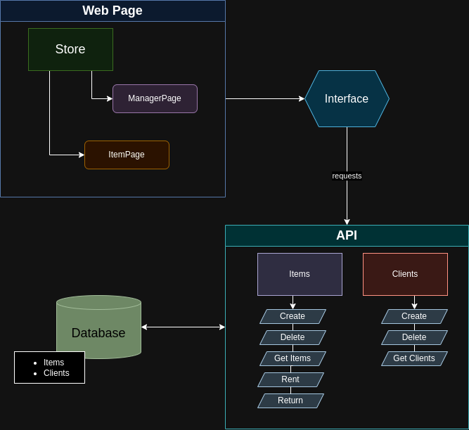

# Rental System

This is an application for managing the rental of items from a store. It includes a managing page for updating the store stock. As well as the interface for clients to rent and return the items.

## Installation 

To accomplish the installation of this system, follow these steps:

```
git clone https://github.com/mSimon12/rental_system
cd rental_system
pip install -r requirements.txt

flask --app flaskr init-db
flask --app flaskr run
```

## Getting Started

## Roadmap

The evolution of this project follows the sequence described below:

### Done: 

1. Initially, the basic implementation of a REST API with Flask have been done following the [Flask guetting started tutorial](https://flask.palletsprojects.com/en/3.0.x/tutorial/)
2. With a first running application, we have configured our Database with SQLite. At this moment we added 2 tables for storing the items from the store and clients.
3. Base CRUD API was implemented to allow adding and deleting items to the store, as well as renting and returning them.
4. Included basic template for store main page, showing the items list and the available amount. Items specific pages were also included for accessing extra information and for item rental.
5. Manager page was inserted for store management.
6. API interface have been implemented to decouple and translate calls made in the Frontend to the Backend.
7. Implemented rent and return buttons in store/item
8. Track on database who rented what
9. Implement use credentials management


### To-Do: 
* Implement authentications
* Save comments added on item page
* Add tests
* create pipeline
* Deploy the application

## System view

