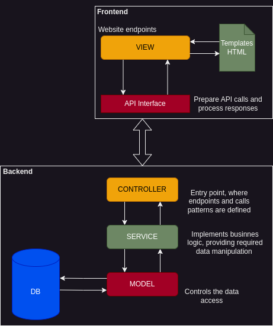

# Rental System


[](https://github.com/mSimon12/rental_system/actions)
[](https://codecov.io/gh/mSimon12/rental_system)

**Rental System** is a simple, multi-service web application designed to help stores manage 
product rentals as they grow. It offers a backend API and a web interface that handle client 
registration, item availability, rental tracking, and administrative stock management.

This application is composed of two services:
- A RESTful **Backend API** built with Flask ([code here](./backend))
- A modern **Angular Frontend** for store operators and clients ([code here](./frontend/rental_system_web))

---

## 🚀 Features

- 🔐 JWT-based user authentication
- 🧾 Client registration, login, and session management  
- 📦 Item rental and return workflows  
- 🗃️ Track which client rented which item  
- 🔄 Admin view for inventory and stock management  
- 🎨 Modern, responsive Angular web interface  
- 🐳 Fully Dockerized with multi-service support  
- 🧪 Unit testing and basic CI setup  

https://github.com/user-attachments/assets/1e4a8d69-29e3-4a72-ba5f-82a43ed2cb36

---

## 🛠️ Tech Stack

<div align="left">
  
  
  
  
  
  
  
  
  
  
  
  
  
  
  
  
</div>

---

## ⚙️ Getting Started

Follow these steps to set up and run the Rental System application locally or using Docker.

### 🔧 Clone the Repository

```bash
git clone https://github.com/mSimon12/rental_system
cd rental_system
```

### 🔐 Environment Setup

The backend service requires a .env file for basic API key authentication. For development, you can use default values:
```bash
echo -e 'API_KEY=default-key\nAPI_SECRET=default-secret' > backend/flaskr/.env
```
> [!NOTE]  
> Be sure to replace these values with secure credentials in production environments.


## ▶️ Running the Application
You can run the system either directly on your machine or using Docker.

### 🐍 Option 1: Run Without Containers
1. Install backend dependencies: ``pip install -r backend/requirements.txt``
2. Install frontend dependencies: ``npm install`` (from `frontend/rental_system_web/` directory)
3. Open two terminals.
- Terminal 1: Start the backend

```bash
# Starts the application database
flask --app backend/flaskr init-db

# Starts the API application
flask --app backend/flaskr run -p 5001
```

- Terminal 2: Start the frontend development server

```bash
cd frontend/rental_system_web

# Starts the Angular development server
npm start
```

The application will be available at `http://localhost:4200`

### 🐳 Option 2: Run with Docker (Recommended)
Start both backend and frontend services using Docker Compose:

```bash
# Starts the complete app 
docker compose -f deploy/compose.yaml up --build
```
Once running, access the services at:
- Frontend: http://localhost:5000
- Backend API: http://localhost:5001


## 🛣️ Roadmap

### 🔧 Backend

- [x] Built a REST API using Flask (based on the [Flask Getting Started tutorial](https://flask.palletsprojects.com/en/3.0.x/tutorial/)).
- [x] Configured SQLite database with models for clients and items.
- [x] Implemented CRUD operations for items and rentals.
- [x] Tracked item-client relationships for rental history.
- [x] Added user registration, login, and role-based access control with JWT.
- [x] Wrote unit tests for core API endpoints (clients and items).
- [x] Set up CI pipeline to run tests on push.
- [x] Dockerized backend service.
- [ ] Migrate from SQLite to PostgreSQL with SQLAlchemy ORM.
- [ ] Add Flask-Admin for admin dashboard capabilities.
- [ ] Support Item image
- [ ] Support item comments and ratings from clients.
- [ ] Deploy backend service.
- [ ] Update items list available info and implement filtering and pagination.

### 🎨 Frontend

- [x] Built a modern Single Page Application (SPA) using Angular with TypeScript.
- [x] Implemented item listings with availability display.
- [x] Created item-specific detail pages.
- [x] Built store manager interface for item and rental management.
- [x] Connected frontend to backend via HTTP service layer.
- [x] Added item rent/return functionality.
- [x] Dockerized frontend service.
- [x] Improved UI/UX with professional styling.
  - [x] Login page
  - [x] Registration page
  - [x] Main store page
  - [x] Item details page
  - [x] Manager dashboard
  - [ ] Add edit popup menu
  - [ ] Add bulk import/update items
- [ ] Add client session and rental history pages.
- [ ] Implement unit and integration tests with Karma/Jasmine.

---

## 🧩 System Architecture

The Rental System application is composed of two isolated services,
a **Backend API** built with Flask and an **Angular Frontend**, both 
deployed as independent containers.

### 🧠 Backend (API Service)

The backend follows a clean **Model–Service–Controller (MSC)** pattern:

- **Model**: Defines database schemas and handles low-level data access.
- **Service**: Implements business logic independently of endpoints or DB concerns, making it easier to evolve and test.
- **Controller**: Manages API routes, request validation, and HTTP responses.

This structure provides clear separation of concerns, improves maintainability, and supports testability.

### 🎨 Frontend (Web Interface)

The frontend is a modern **Single Page Application (SPA)** built with **Angular** and **TypeScript**. It includes:

- **Components**: Reusable UI building blocks (Header, Footer, Item Card, Login, etc.) with encapsulated styles and logic.
- **Services**: API abstraction layer that handles HTTP communication with the backend, providing clean data access to components.
- **Routes**: Angular routing enables client-side navigation between pages without full page reloads.
- **Guards**: Route protection to ensure authenticated access to admin and protected pages.

This approach provides a responsive, interactive user experience with client-side rendering while maintaining clean separation between UI and business logic.

### 🔁 Request Flow

The user interacts with the **Angular Frontend**, which:
1. Calls **Angular Services**, preparing and sending HTTP requests to the backend API.
2. The **Backend Controller** receives the request, calls the appropriate **Service**, and uses the **Model** layer to read/write data.
3. **API Responses** are returned to the Frontend services, which update component state and trigger UI re-rendering.
4. The **Angular component** displays the updated data to the user in real-time without requiring page reloads.


